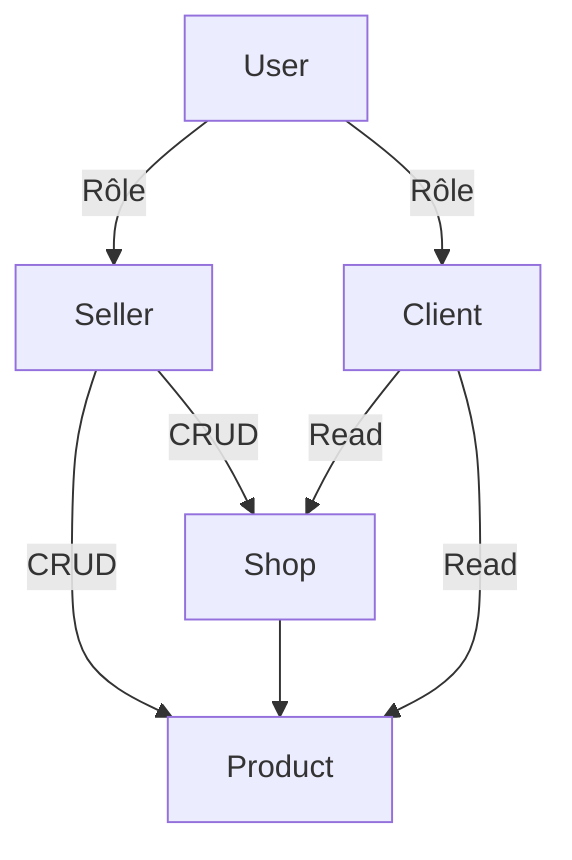

# ZOMANA

## Table des matières

* Introduction
* Authentification
* Client
* Seller
* Shop
* Product

Diagramme
---

### Partie Authentification

Méthode de requête HTTP | Route | Fonctionnalité |
------------ | ------------- | ---------------- |
POST | http://127.0.0.1:3000/api/signup  | Crée un compte utilisateur | 
POST | http://127.0.0.1:3000/api/signin |Connexion compte utilisateur | 
GET | http://127.0.0.1:3000/api/getuser |Afficher tout les Users existant | 
### Partie Client

Méthode de requête HTTP | Route | Fonctionnalité |  
------------- | ------------- | ---------------- | 
POST | http://127.0.0.1:3000/api/client-account/:id  | Création d'un compte Client en ajoutant son `id`
GET | http://127.0.0.1:3000/api/get-client | Afficher toutes les informations des comptes clients disponible
GET | http://127.0.0.1:3000/api/get-client/:user_id | Afficher toutes les informations du compte clients associé a un `user_id`
DELETE | http://127.0.0.1:3000/api/delete-client/:user_id | Suppression de toutes les informations du compte clients associé au `user_id` donnée
PUT | http://127.0.0.1:3000/api/modify-client/:user_id | Modification d'une ou plusieurs informations du compte clients associé au `user_id`

### Partie Seller

Méthode de requête HTTP | Route | Fonctionnalité |  
------------ | ------------- | ---------------- | 
POST | http://127.0.0.1:3000/api/seller-account/:id  | Créer un compte Seller en ajoutant en paramètre son `id` afin de l'associé a son compte user
GET | http://127.0.0.1:3000/api/get-seller | Afficher toutes les informations de tous les comptes seller créer
GET | http://127.0.0.1:3000/api/get-seller/:user_id | Afficher toutes les informations du compte seller associé au `user_id` mis en paramètre.
DELETE | http://127.0.0.1:3000/api/delete-seller/:user_id | Suppression de toutes les informations du compte seller associé au paramètre `user_id` 
PUT | http://127.0.0.1:3000/api/modify-seller/:user_id | Modification d'une ou plusieurs informations du compte seller associé au `user_id`

### Partie Shop

Méthode de requête HTTP | Route | Fonctionnalité |  
------------ | ------------- | ---------------- | 
POST | http://127.0.0.1:3000/api/seller-shop/:user_id  | Création d'un shop associé au `user_id` role seller
GET | http://127.0.0.1:3000/api/get-shop | Afficher toutes les informations des differents shop créer
GET | http://127.0.0.1:3000/api/get-shop/:user_id |Afficher toutes les informations du ou des shop(s) associé au `user_id` 
DELETE | http://127.0.0.1:3000/api/delete-shop/:user_id | Suppression de toutes les informations du shop associé au seller via le `user_id` 
PUT | http://127.0.0.1:3000/api/modify-shop/:user_id | Modification d'une ou plusieurs informations du shop associé au `user_id`

### Partie Product 

Méthode de requête HTTP | Route | Fonctionnalité |  
------------ | ------------- | ---------------- | 
POST | http://127.0.0.1:3000/api/new-product/:user_id/:_id | Creer un products avec le `user_id` et  `shop_id` |
GET | http://127.0.0.1:3000/api/all-product | Afficher tout les products existant |
GET | http://127.0.0.1:3000/api/all-product-shop/:_id | Afficher tout les products associé a l'`id` mis en paramètre|
GET | http://127.0.0.1:3000/api/product-from-shop/:_id | Afficher tous les prproductsoduits d'une boutique via l'`id`|
DELETE | http://127.0.0.1:3000/api/delete-product/:_id | Supprimer le products via son `id` |
PUT | http://127.0.0.1:3000/api/modify-product/:_id | Modifier le products via l'`id` mis en paramètre|